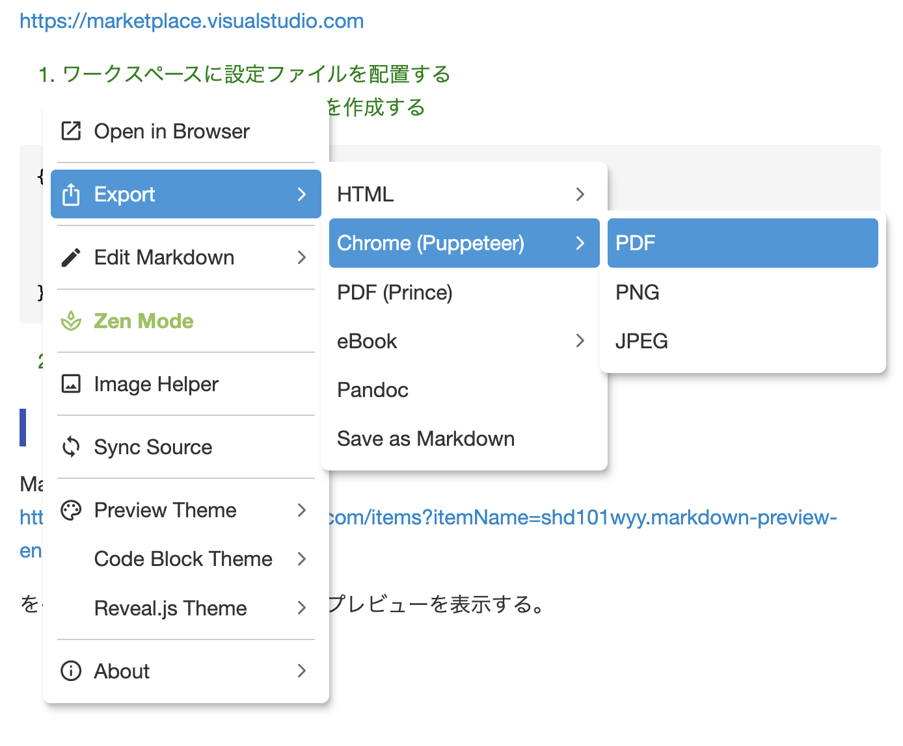

# markdown_setting

Markdownで記載したものをPDFに変換するときなどにシンプルにかつ装飾を加えて出力できるようにしたい

### ■ 前提条件
Visual Studo Codeで以下のプラグインがインストールされている環境であることを前提に記載する。

Markdown PDF - Visual Studio Marketplace
https://marketplace.visualstudio.com


1. ワークスペースに設定ファイルを配置する
   Markdown.code-workspaceを作成する

```workspace
{
    "settings": {
        "markdown-pdf.styles": ["./styles.css"]
    }
}
```
  2. ./styles.cssのファイルに対してCSSファイルを作成する


### 方法2
#### 設定
1. 「Ctrl + Shift + P」で検索窓を出します（Macの場合は、コマンドパレットに２．のコマンドを入力し実行する
2. 「Markdown Preview Enhanced: Customize CSS」を入力してEnter
3. CSSのデータを`styles.css`の内容を入力する。
4. 実際に編集中のMarkdownデータを表示することで、整形された状態でエクスポートができる。

#### エクスポート
Markdown Preview Enhanced
https://marketplace.visualstudio.com/items?itemName=shd101wyy.markdown-preview-enhanced

をインストールし、Markdownでプレビューを表示する。



